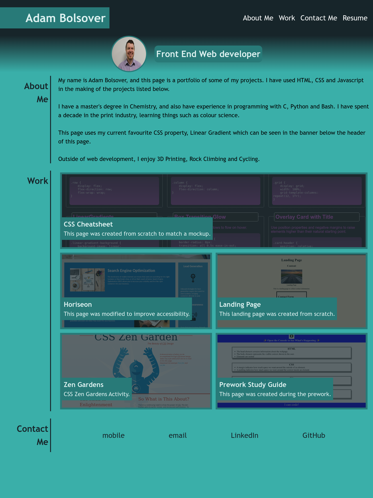
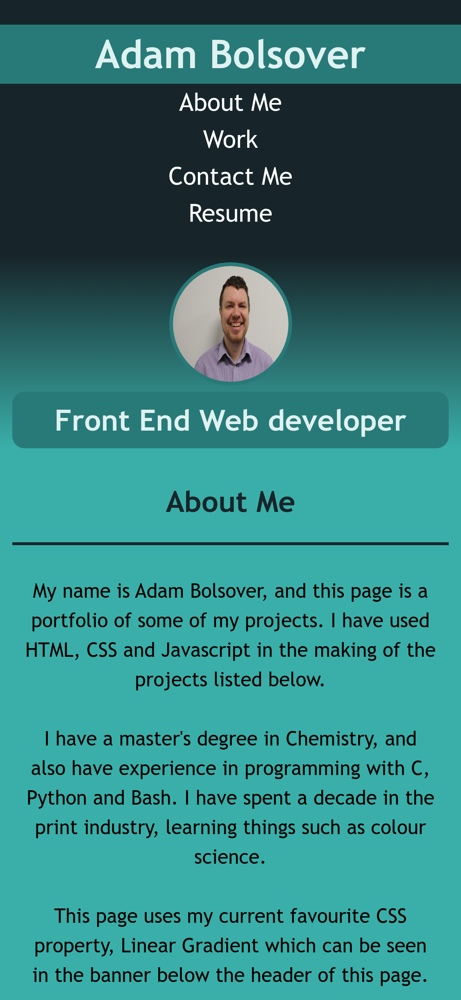

# Bootcamp Challenge 2 - Portfolio
A portfolio page of projects completed.

## Description 

For this project, a portfolio webpage was created designed for hiring managers. The site had to include:

* When the page is loaded the page presents your name, a recent photo or avatar, and links to sections about you, your work, and how to contact you.
* When one of the links in the navigation is clicked then the UI scrolls to the corresponding section.
* When viewing the section about your work then the section contains titled images of your applications.
* When presented with the your first application then that application's image should be larger in size than the others.
* When images of the applications are clicked then the user is taken to that deployed application.
* When the page is resized or viewed on various screens and devices then the layout is responsive and adapts to my viewport

## Installation

The site does not require installation steps.

## Usage 

The website can be viewed at [https://bowseruk.github.io/bootcamp-portfolio/](https://bowseruk.github.io/bootcamp-portfolio/) with Google Chrome. The source can be viewed in Chrome by right clicking and selecting inspect.
### Standard View

### Mobile View

### High Resolution View

## Credits

This site was based on a project by edX Boot Camps LLC.

[W3School](https://www.w3schools.com/) was used as a reference for elements to use and good practice.

The changes were checked with [W3C Validator](https://validator.w3.org/).

## License

This project uses the licence in the LICENCE file of the repo.
